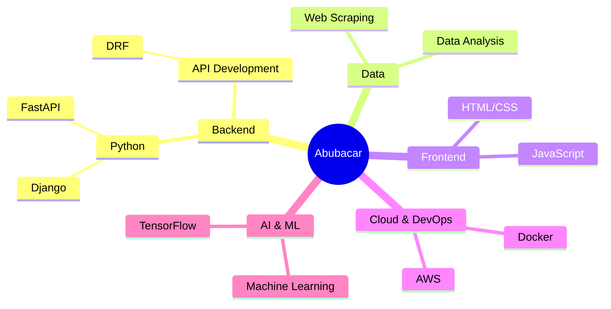
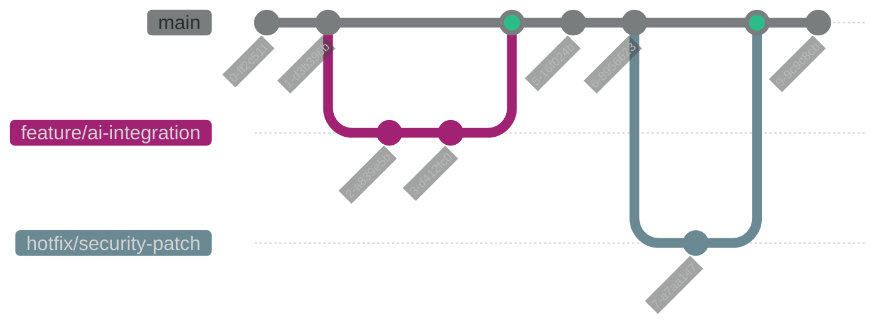

  
# 🌟 Abubacar Soumah | Software Engineer Extraordinaire 🚀

---

## 🧬 Tech DNA: Where Code Meets Innovation

## 🚀 Projet Showcase: Coding Marvels Unleashed

<table>
  <tr>
    <td width="50%">
      <h3 align="center">DjangoVerse Explorer</h3>
      
      

        Navigateur multidimensionnel des possibilités de Django.
          
        
        
      

    </td>
    <td width="50%">
      <h3 align="center">DataSculptor AI</h3>
      
      

        Plateforme de modélisation IA pour données complexes.
          
        
        
      

    </td>
  </tr>
</table>

## 💻 Code Wizardry: My Tech Arsenal

## 📊 GitHub Skyline: A Year in Code

  

  

## 🌟 Contribution Constellation

## 🚀 Current Mission: Pioneering the AI Frontier

🔭 Actuellement, je travaille sur l'intégration de modèles de Machine Learning avancés dans des applications web Django robustes.

🌱 J'apprends les dernières techniques en Deep Learning et en traitement du langage naturel pour créer des solutions IA plus intelligentes et intuitives.

👯 Je cherche à collaborer sur des projets open-source innovants qui repoussent les limites de la technologie.

💬 Discutons de l'architecture des microservices, de l'optimisation des performances Django, ou de la façon dont l'IA transforme le développement logiciel !

## 📬 Let's Connect and Create Something Extraordinary!

---

  

  
> "Le code est ma toile, la logique mon pinceau, et chaque projet une œuvre d'art en devenir." - Abubacar Soumah

  

