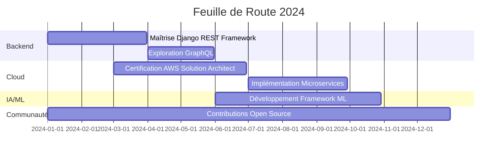

<h1 align="center">
  
</h1>

  

  

  
  
  
  

<h2 align="center">🚀 Expertise Technique</h2>

  
  
  
  
  
  
  
  

  
<h2>📊 Tableau de Bord GitHub</h2>

  

    
  

  

    
    
  

  

    
  

<h2 align="center">🌟 Projets Phares</h2>

  
  

<h2 align="center">🌠 Vision & Objectifs</h2>

<h2 align="center">📈 Activité GitHub</h2>

  

<h2 align="center">🤝 Collaborons</h2>

  <i>"L'innovation naît de la collaboration. Ensemble, créons l'avenir de la tech !"</i>

  
  

  

