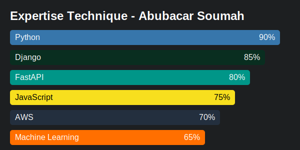

# 🌟 Abubacar Soumah | Software Engineer 🚀

## 💼 Technical Expertise

  

## 🚀 Flagship Projects

<table>
  <tr>
    <td width="50%">
      <h3 align="center">🌐 Predictive Analysis Platform</h3>
      

        Advanced analysis solution integrating ML for accurate predictions.
          
        
        
      

    </td>
    <td width="50%">
      <h3 align="center">🔄 Scalable Microservices System</h3>
      

        Highly performant and scalable microservices architecture.
          
        
        
      

    </td>
  </tr>
</table>

## 💻 Tech Stack

## 📊 GitHub Statistics

  

  

## 🎯 Current Focus

🔭 Developing robust web applications integrating AI and cloud computing.

🌱 Deepening knowledge in deep learning and NLP to create innovative solutions.

👯 Seeking collaborations on high-impact open-source projects.

💬 Open to discussions on microservices architecture, Django performance optimization, and AI integration in software development.

## 📬 Let's Connect

---

  

  
> "Innovation is born from the fusion of creativity and technical expertise." - Abubacar Soumah

  

