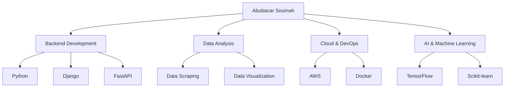

  
# 🌟 Abubacar Soumah | Software Engineer Innovant 🚀

---

## 💼 Expertise Technique

## 🚀 Projets Phares

<table>
  <tr>
    <td width="50%">
      <h3 align="center">🌐 Plateforme d'Analyse Prédictive</h3>
      

        Solution d'analyse avancée intégrant ML pour prédictions précises.
          
        
        
      

    </td>
    <td width="50%">
      <h3 align="center">🔄 Système de Microservices Évolutif</h3>
      

        Architecture de microservices hautement performante et scalable.
          
        
        
      

    </td>
  </tr>
</table>

## 💻 Stack Technologique

## 📊 Statistiques GitHub

  

  

## 🎯 Focus Actuel

🔭 Développement d'applications web robustes intégrant l'IA et le cloud computing.

🌱 Approfondissement des connaissances en deep learning et NLP pour créer des solutions innovantes.

👯 Recherche de collaborations sur des projets open-source à fort impact technologique.

💬 Ouvert aux discussions sur l'architecture des microservices, l'optimisation des performances Django, et l'intégration de l'IA dans le développement logiciel.

## 📬 Restons en Contact

---

  

  
> "L'innovation naît de la fusion entre la créativité et l'expertise technique." - Abubacar Soumah

  

