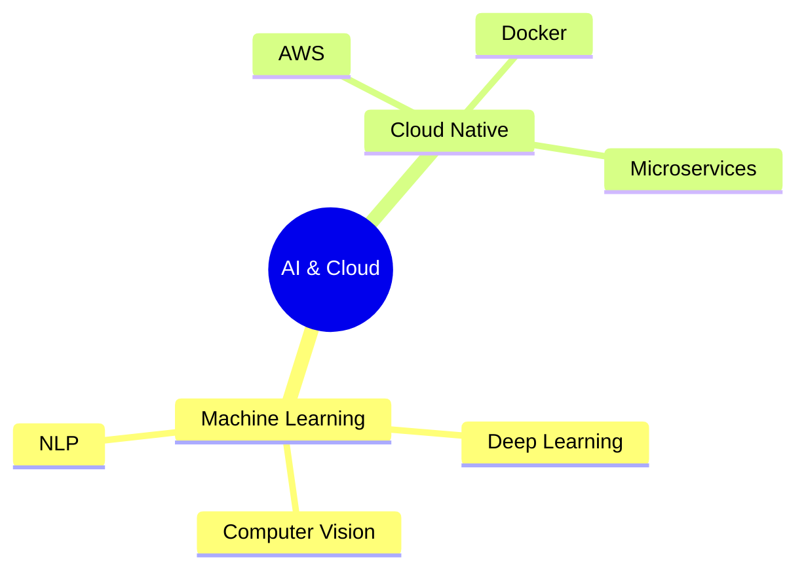

# Aboubacar Soumah
> Software Engineer & AI Specialist

### 🛠️ Technologies

  

### 🎯 Focus

```mermaid
mindmap
  root((AI & Cloud))
    Machine Learning
      Deep Learning
      Computer Vision
      NLP
    Cloud Native
      AWS
      Docker
      Microservices
```

### 📊 Stats

  

