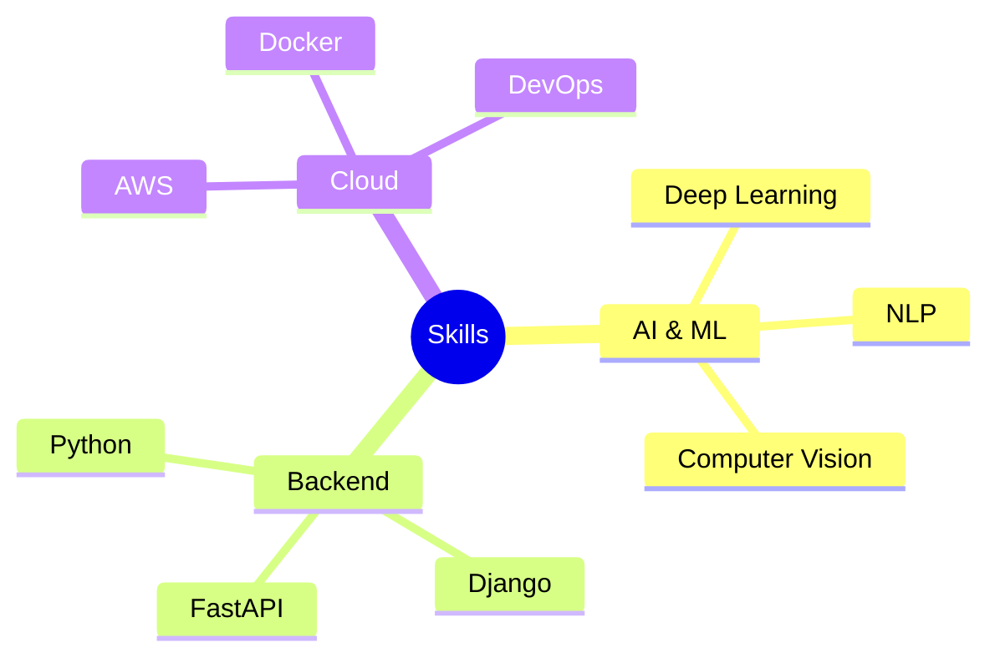

# Abubacar Soumah
### Software Engineer & AI Specialist

  
  
  

### Expertise
- AI Engineering
- Cloud Architecture 
- Software Development

### Technologies

  

### Certifications
- AWS Solutions Architect Associate
- TensorFlow Developer
- Python Professional Certificate

### Focus Areas 2024-2025

```mermaid
mindmap
  root((Skills))
    AI & ML
      Deep Learning
      NLP
      Computer Vision
    Backend
      Python
      Django
      FastAPI
    Cloud
      AWS
      Docker
      DevOps
```

  

