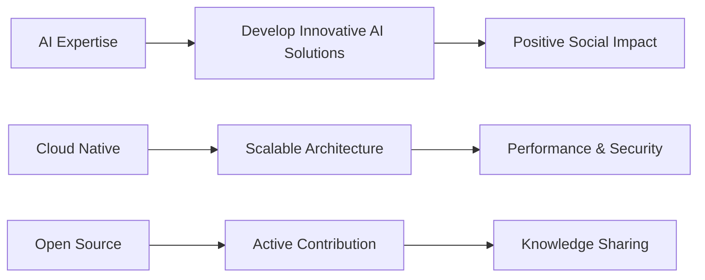
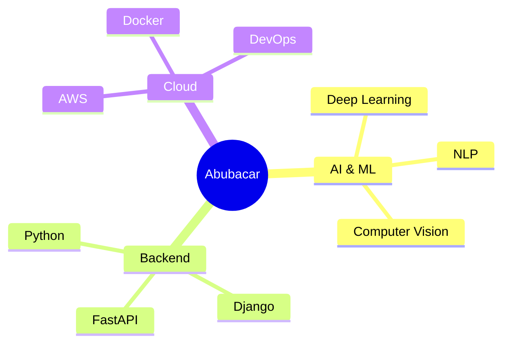

<div align="center">
  
</div>

<div align="center">
  <a href="https://www.linkedin.com/in/aboubacarsoumah/"></a>
  <a href="mailto:soumahaboubacarsopra@gmail.com"></a>
  <a href="https://twitter.com/AbubacarSoumah"></a>
</div>

<br>

<div align="center">
  
  
  
</div>

## 🎯 Current Focus

```python
class SoftwareEngineer:
    def __init__(self):
        self.name = "Abubacar Soumah"
        self.role = "Software Engineer"
        self.language_spoken = ["fr_FR", "en_US"]
        
    def say_hi(self):
        print("Thanks for visiting my profile! Let's build something extraordinary together!")

me = SoftwareEngineer()
me.say_hi()
```

## 💻 Tech Stack

<div align="center">
  
</div>

## 📊 Analytics

<div align="center">
  
  
</div>

## 🎓 Certifications & Education

<div align="center">
  <a href="#"></a>
  <a href="#"></a>
  <a href="#"></a>
</div>

## 🎯 Goals 2024-2025


```mermaid
graph LR
    A[AI Expertise] --> B[Develop Innovative AI Solutions]
    B --> C[Positive Social Impact]
    D[Cloud Native] --> E[Scalable Architecture]
    E --> F[Performance & Security]
    G[Open Source] --> H[Active Contribution]
    H --> I[Knowledge Sharing]
```

## 🌟 Areas of Expertise


```mermaid
mindmap
  root((Abubacar))
    AI & ML
      Deep Learning
      NLP
      Computer Vision
    Backend
      Python
      Django
      FastAPI
    Cloud
      AWS
      Docker
      DevOps
```

<div align="center">
  
</div>


