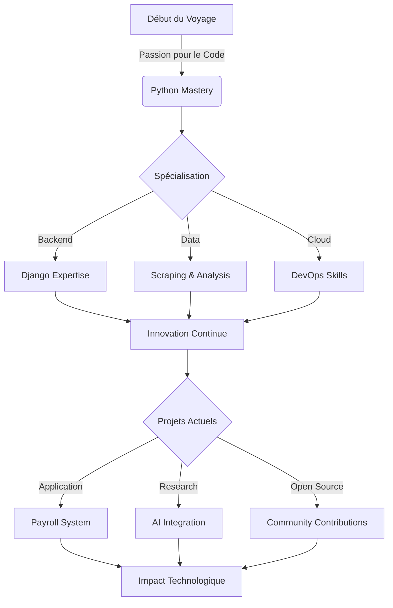
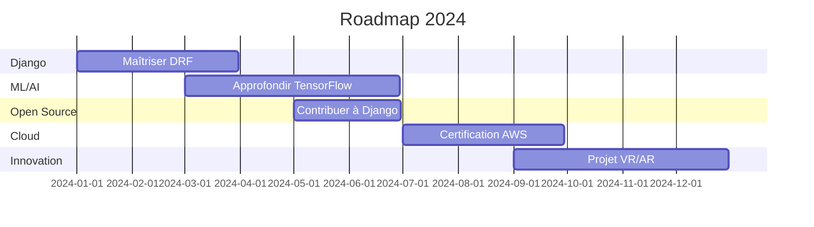

<h1 align="center">
  
</h1>

  

  
  
  
  

<h2 align="center">🚀 Voyage Technologique</h2>

  

```mermaid
graph TD
    A[Début du Voyage] -->|Passion pour le Code| B(Python Mastery)
    B --> C{Spécialisation}
    C -->|Backend| D[Django Expertise]
    C -->|Data| E[Scraping & Analysis]
    C -->|Cloud| F[DevOps Skills]
    D & E & F --> G[Innovation Continue]
    G --> H{Projets Actuels}
    H -->|Application| I[Payroll System]
    H -->|Research| J[AI Integration]
    H -->|Open Source| K[Community Contributions]
    I & J & K --> L[Impact Technologique]
```

<h2 align="center">🛠️ Arsenal Technologique</h2>

  

<h3>🔍 Plongée Profonde</h3>

 

| Catégorie | Technologies |
|-----------|--------------|
| 🐍 Langages |     |
| 🧰 Frameworks |    |
| 🗄️ Databases |    |
| ☁️ Cloud |   |
| 🧠 ML/AI |   |
| 🔧 Tools |    |

<h2 align="center">📊 Impact Quantifié</h2>

  
  

    
  

<h2 align="center">🏗️ Projets Phares</h2>

<h3 align="center">🎥 Démonstrations Visuelles</h3>

<table>
  <tr>
    <td width="50%">
      <h3 align="center">Construction Project Tracker</h3>
      

        
      

      

        
        
      

    </td>
    <td width="50%">
      <h3 align="center">Industrial Production Tracker</h3>
      

        
      

      

        
        
      

    </td>
  </tr>
</table>

<h2 align="center">📚 Articles & Insights</h2>

  
  

<table align="center">
  <tr>
    <td>
      
    </td>
    <td>
      
    </td>
  </tr>
  <tr>
    <td>
      
    </td>
    <td>
      
    </td>
  </tr>
</table>

<h2 align="center">🌟 Objectifs 2024</h2>

  

```mermaid
gantt
    title Roadmap 2024
    dateFormat  YYYY-MM-DD
    section Django
    Maîtriser DRF           :2024-01-01, 90d
    section ML/AI
    Approfondir TensorFlow  :2024-03-01, 120d
    section Open Source
    Contribuer à Django     :2024-05-01, 60d
    section Cloud
    Certification AWS       :2024-07-01, 90d
    section Innovation
    Projet VR/AR            :2024-09-01, 120d
```

<h2 align="center">🤝 Collaborons</h2>

   <em>J'adore connecter avec différentes personnes, alors si vous voulez dire bonjour, je serais ravi de vous rencontrer plus! :)</em>

  
  
  

